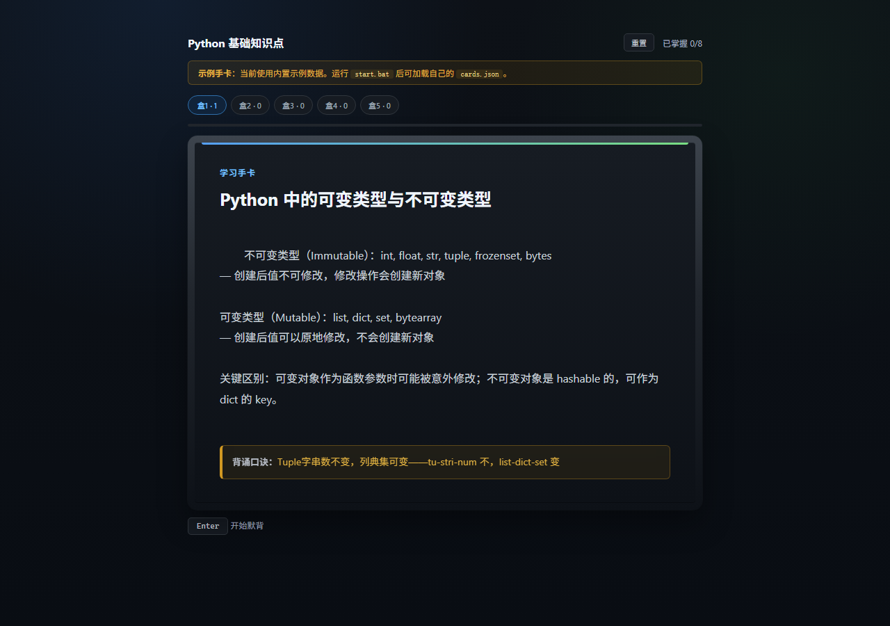

<div align="center">

# Recite Coach: PDF-to-Flashcards Skill and Local Leitner Player

**Turn PDFs and notes into score-point flashcards, then review them locally in your browser.**

<br />

[](https://github.com/lixingjian2005/recite-coach/stargazers)

<br />

[](LICENSE)
&nbsp;
[](serve.py)
&nbsp;
[](#security-and-privacy)
&nbsp;
[](CONTRIBUTING.md)

<br />

[中文](#中文说明) | [English](#english) | [Quick start](#quick-start) | [Security](#security-and-privacy)

</div>



## 中文说明

Recite Coach 是一个“背诵材料生成 + 本地手卡复习”的工具包。它适合期末复习、考研/考公背诵、面试准备、语言学习，以及任何需要反复默背的材料。

项目分成两部分：

| 部分 | 作用 |
|------|------|
| Skill workflow | 指导 Codex/Claude 等 agent 把 PDF、讲义、笔记压缩成踩分点背诵清单，再生成 `cards.md`（自动转为 `cards.json`） |
| Local player | 读取 `cards.json`，在浏览器里进行学习、背默、对照答案、自评和 Leitner 间隔复习 |

它不是一个独立的 PDF 自动转换器。PDF 到卡片的整理由 agent 按 Skill 指令完成；网页应用负责播放已经生成好的卡片。

安装 Skill 后，agent 会把播放器启动包复制到你的输出目录，并自动将 `cards.md` 转换为 `cards.json`。你不需要手动处理 JSON 文件。

## English

Recite Coach helps you build compact flashcards from study material and review them locally. The repository includes a Skill workflow for generating cards and a browser player for memorization.

The Skill side turns PDFs, lecture notes, textbooks, tables, or pasted text into a score-point memorization list, then into `cards.md` (structured markdown). A converter script automatically produces valid `cards.json`. The local player reads that JSON file and runs a simple Leitner-style review session.

## Why this exists

Most study material is too long to memorize directly. Notes often mix scoring points, background explanation, examples, and filler.

Recite Coach separates the two jobs:

| Before | After |
|--------|-------|
| A long PDF or lecture handout | A compact score-point list |
| Loose notes | Structured Q&A cards |
| Manual rereading | Local review with self-rating |
| Browser tab or cloud app | A local player on `127.0.0.1` |

## Quick start

### Install the Skill

```bash
npx skills add lixingjian2005/recite-coach
```

This installs the `recite-coach` skill for Claude Code, Codex, GitHub Copilot, and other compatible agents. After installation, agents can turn PDFs, notes, and lecture material into `cards.md` (auto-converted to `cards.json`) automatically.

### If you already have `cards.md` or `cards.json`

Put `cards.md` or `cards.json` in the project root, next to `serve.py`. If you have `cards.md`, run the deploy script to convert it and copy the player kit:

```bash
python recite-coach/assets/deploy-player-kit.py .
```

Then start the local player.

Windows:

```bat
start.bat
```

Or double-click `start.vbs` if you do not want a visible console window.

macOS / Linux:

```bash
./start.sh
```

Universal:

```bash
python serve.py
```

The browser opens automatically. Use `Enter` to move from study to recall, then to the answer. Use `1-4` to rate yourself.

> Do not use direct double-clicking on `recite-player.html` as the main workflow. `file://` mode may not load the latest `cards.json` reliably and does not provide the same file-backed progress behavior.

### If you only have a PDF, notes, or lecture material

Install the skill first:

Then use the Skill workflow:

1. Ask your agent (Claude Code / Codex / Copilot) to use `recite-coach`.
2. The agent will extract a score-point memorization list from the full material.
3. The agent will convert that list into `cards.md` (structured markdown).
4. The agent should write `cards.md` to your current project root or a directory you name.
5. The agent will run the deploy script, which converts `cards.md` → `cards.json` and copies the local player kit.
6. Start the local player with one of the commands above.

If your input is already a concise memorization list, skip the extraction step and generate cards directly.

## How the Skill workflow works

```text
PDF / notes / lecture material
        |
        v
Score-point memorization list
        |
        v
cards.md  (structured markdown, no JSON quoting issues)
        |
        v
cards.json  (auto-generated by deploy script)
        |
        v
Local browser review
```

Relevant files:

- [`recite-coach/SKILL.md`](recite-coach/SKILL.md) controls the overall workflow.
- [`recite-coach/card-generator/SKILL.md`](recite-coach/card-generator/SKILL.md) handles score-point extraction and card generation.

## Card format

Cards are authored as structured markdown (`cards.md`) and auto-converted to JSON by the deploy script. The `cards.json` schema is:

```json
{
  "title": "Python 基础知识点",
  "newItemsPerSession": 3,
  "items": [
    {
      "id": 1,
      "title": "列表和元组的区别？",
      "importance": 1,
      "content_full": "(1) 列表可变，元组不可变\n(2) 列表用 []，元组用 ()\n(3) 元组可作为 dict 的 key",
      "mnemonic": "列表可变方括号，元组固定圆括号",
      "hints": ["哪个可以作为 dict 的 key？", "可变的是 list"]
    }
  ]
}
```

| Field | Meaning |
|-------|---------|
| `title` | Deck title |
| `newItemsPerSession` | New cards introduced per session |
| `items[].id` | Sequential card ID |
| `items[].title` | Prompt or question |
| `items[].importance` | `1` core, `2` important, `3` optional |
| `items[].content_full` | Answer shown after recall |
| `items[].mnemonic` | Optional memory aid |
| `items[].hints` | Optional hint list |

## Review flow

| Step | Action |
|------|--------|
| Learn | Read the card and mnemonic |
| Recall | Press `Enter` and type or mentally recall the answer |
| Check | Press `Enter` again to compare with the answer |
| Rate | Press `1-4` to score your recall |

Rating:

| Key | Meaning |
|-----|---------|
| `1` | Again, forgot it |
| `2` | Hard, incomplete recall |
| `3` | Good, mostly correct |
| `4` | Easy, delay the next review |

## What is included

```text
.
├── recite-coach/
│   ├── SKILL.md
│   ├── assets/
│   │   ├── md2cards.py
│   │   ├── deploy-player-kit.py
│   │   └── player-kit/
│   │       ├── recite-player.html
│   │       ├── serve.py
│   │       ├── start.bat
│   │       ├── start.vbs
│   │       └── start.sh
│   └── card-generator/
│       └── SKILL.md
├── recite-player.html
├── serve.py
├── start.bat
├── start.vbs
├── start.sh
├── cards.md
├── cards.json
├── cards.template.json
└── example-cards/
```

Example decks:

| File | Content |
|------|---------|
| [`cards.json`](cards.json) | Default Python demo deck |
| [`cards.template.json`](cards.template.json) | Backup copy of the demo deck |
| [`example-cards/demo-programming.json`](example-cards/demo-programming.json) | Programming cards |
| [`example-cards/demo-english.json`](example-cards/demo-english.json) | English cards |

## Security and privacy

- `cards.md` and `cards.json` may contain private notes. Check them before publishing or sharing.
- `.recite-progress.json` stores local study progress. Do not commit or share it.
- `serve.py` listens on `127.0.0.1`, so the player is for local access.
- Do not publish copyrighted textbook excerpts, exam dumps, private notes, or personal data.
- If you publish a deck, confirm that the source material allows it.

## Development

The local server uses only the Python standard library.

Run it manually:

```bash
python serve.py
```

Build a Windows executable:

```bash
pip install pyinstaller
pyinstaller ReciteCoach.spec
```

Put build artifacts in GitHub Releases instead of committing them to the repository.

## Contributing

Small, practical improvements are welcome:

- clearer Skill instructions
- better example decks
- player UI fixes
- launcher fixes for Windows, macOS, or Linux
- documentation improvements

Please avoid submitting private notes, copyrighted textbook excerpts, or exam dumps.

## License

MIT. See [`LICENSE`](LICENSE).

---

<div align="center">

Built by [lixingjian2005](https://github.com/lixingjian2005)

<br />

If Recite Coach is useful to you, starring the repo helps other learners find it.

<br />

[](https://github.com/lixingjian2005/recite-coach/stargazers)

</div>
